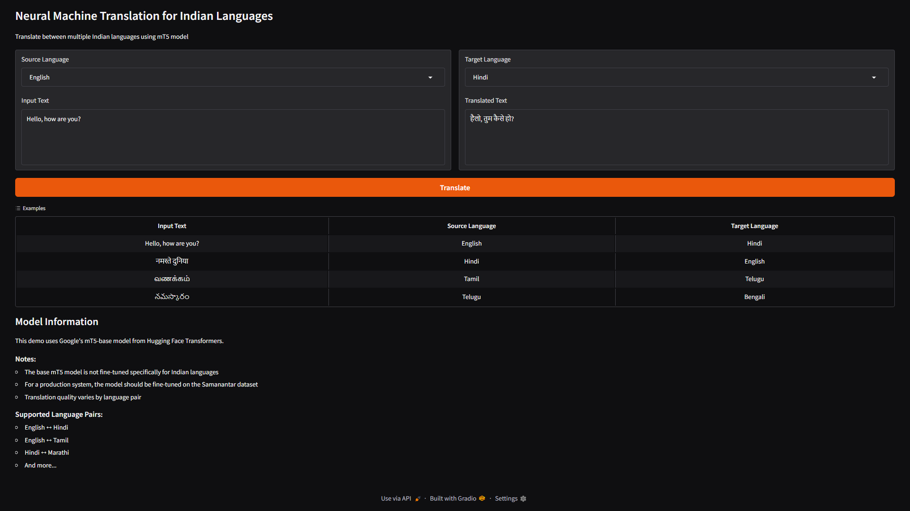

# Neural Machine Translation for Indian Languages

This project implements a Neural Machine Translation system for Indian languages using the MarianMT model, with a user-friendly Gradio interface.



## Features

- Translate between multiple Indian languages
- Support for English, Hindi, Tamil, Telugu, Bengali, Marathi, and Gujarati
- User-friendly web interface built with Gradio
- Example translations included

## Installation

### Local Setup with Virtual Environment

1. Clone the repository:
```bash
git clone https://github.com/yourusername/NLPA_Assignment_2_Group_54.git
cd NLPA_Assignment_2_Group_54
```

2. Create and activate a virtual environment:
```bash
python -m venv venv
source venv/bin/activate  # On Windows, use: venv\Scripts\activate
```

3. Install the required packages:
```bash
pip install -r requirements.txt
```

## Usage

1. Make sure your virtual environment is activated
2. Run the application:
```bash
python nmt_ui.py
```
3. Open your browser and navigate to `http://localhost:7860`

## Supported Language Pairs

- English ↔ Hindi (using MarianMT)
- Other language pairs (work in progress)

## Project Structure

```
NLPA_Assignment_2_Group_54/
├── nmt_ui.py        # Main application file with Gradio interface
├── requirements.txt  # Python dependencies
└── README.md        # Project documentation
```

## Contributing

1. Fork the repository
2. Create your feature branch
3. Commit your changes
4. Push to the branch
5. Open a Pull Request

## License

MIT

## Group Members

- Shubhra J Gadhwala: 2023aa05750
- Sandeep Kumar Yadav: 2023ab05047
- Ravi Krishna Mayura: 2023ab05157
- Satheesh Kumar G: 2023ab05041
